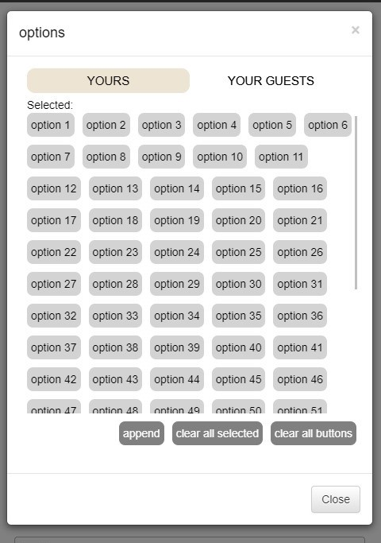

# VanillaJS Dynamic Renderer

A function written in vanilla js. Perform dynamic rendering mainly using ES6 [Proxy](https://developer.mozilla.org/ja/docs/Web/JavaScript/Reference/Global_Objects/Proxy)\
Can subscribe to state changes and invoke re-render.\
Suitable for adding a specific part of area for dynamic rendering.\
\
For example, only perform dynamic rendering inside a modal dialog while other parts are written statically.\
\
\
[DEMO](https://shino369.github.io/vanilla-js-dynamic-renderer/)
## How to use

Include the dynamic_renderer.js file into your html file.\
In your index.html, add:

```html
<div id="render-area"></div>
```

Initialize by calling `new DynamicRender({...})` :

```javascript
const initialState = {
  selectedSet: new Set(),
  options: new Array(200).fill(0).map((arr, index) => ({
    label: `option ${index + 1}`,
    value: index + 1,
  })),
}

/**
 * return template html
 * @param {Object} props
 * @returns
 */
const template = (props) => {
  // write your html here
  // if using template literal, i.e. `<div>${child}</div>`, return with stringToHTML()
  // const {...} = props
  return wrapperFragment([MainContainer()]);
};

// custom update function
const onStateUpdate = (oldState, newState) => {
  console.log('old state: ', oldState);
  console.log('new state: ', newState);
};

const renderer = new DynamicRender({
  selector: '#render-area',
  data: initialState,
  template: (props) => {
    return template(props);
  },
  // func will be fired each time
  actions: [onStateUpdate],
});

// start rendering
renderer.render();

```

To update a state, call:
```javascript
renderer.setState({key: newValue})
```
or directly
```javascript
renderer._state[key] = newValue
```
